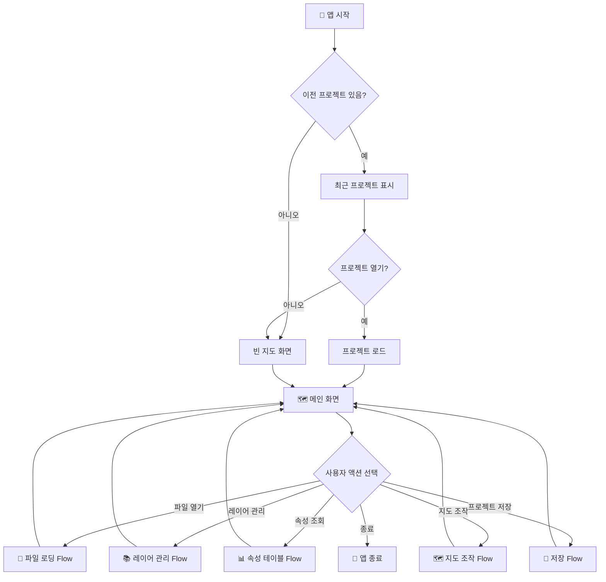
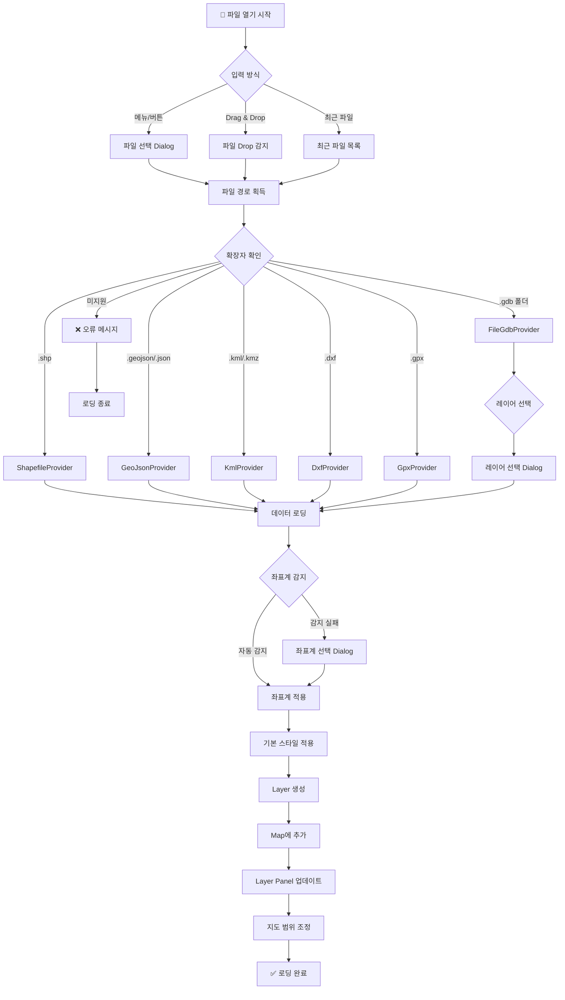
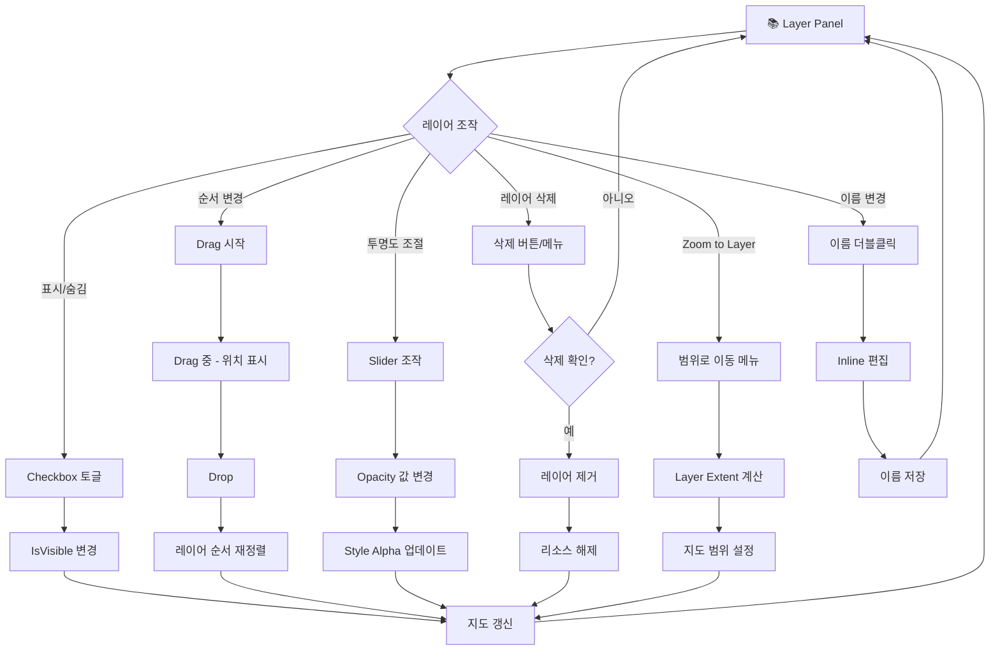
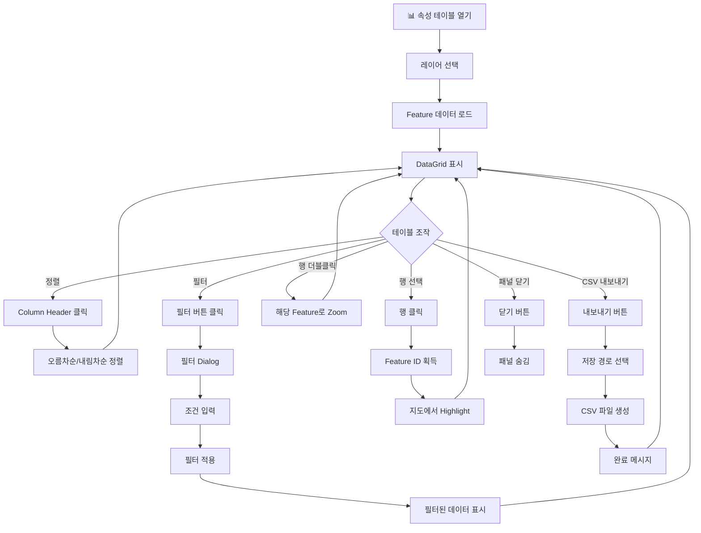
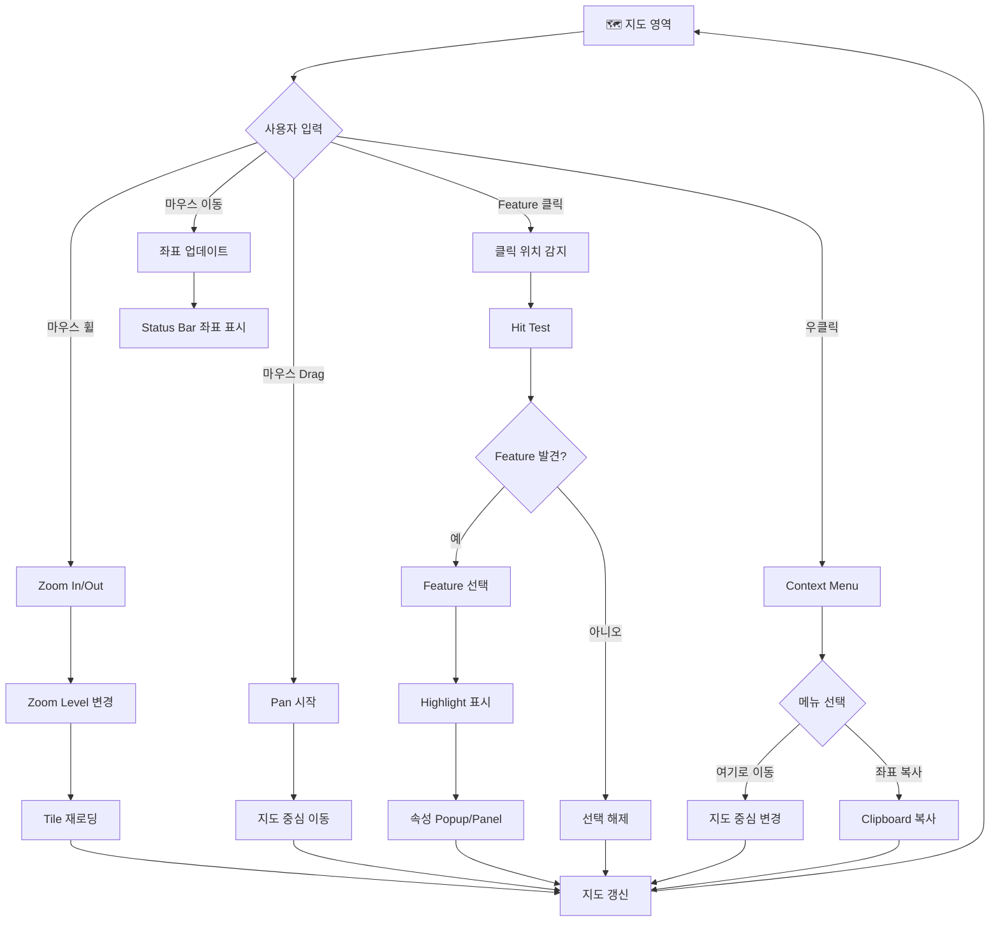
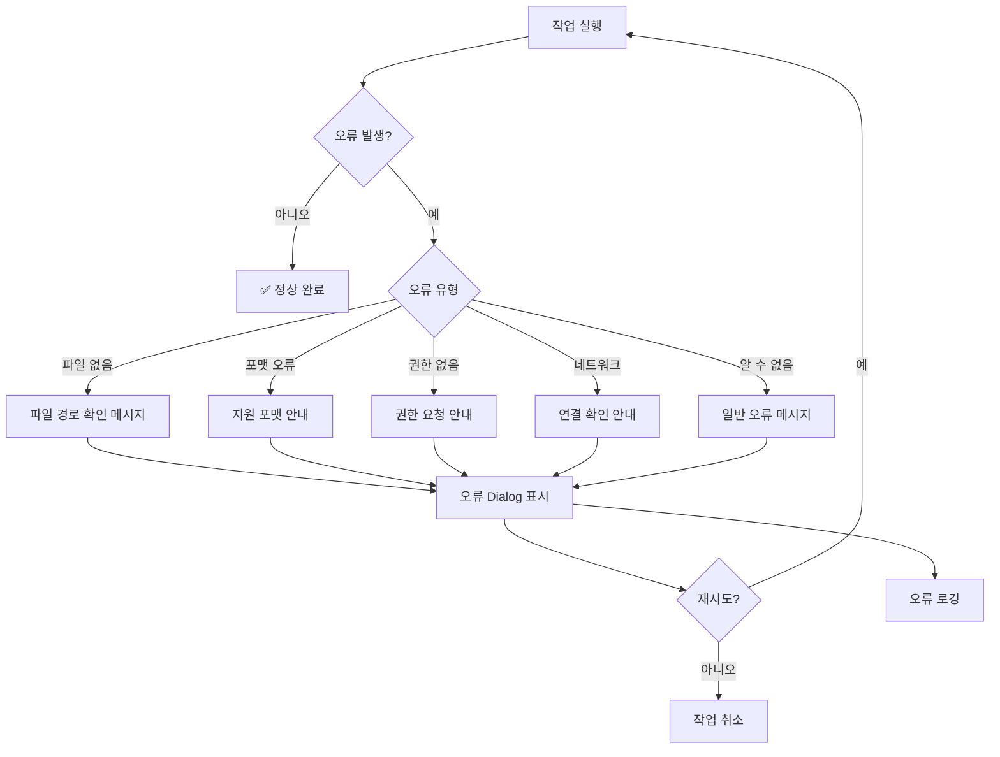

# SpatialView - User Flow (사용자 흐름도)

---

## 1. Main Application Flow (메인 애플리케이션 흐름)

---

## 2. File Loading Flow (파일 로딩 흐름)

---

## 3. Layer Management Flow (레이어 관리 흐름)

---

## 4. Attribute Table Flow (속성 테이블 흐름)

---

## 5. Map Interaction Flow (지도 조작 흐름)

---

## 6. Project Save/Load Flow (프로젝트 저장/불러오기 흐름)

```mermaid
graph TD
    subgraph Save Flow
        A[💾 저장 시작] --> B{저장 경로 있음?}
        B -->|예| C[기존 경로에 저장]
        B -->|아니오| D[다른 이름으로 저장]
        D --> E[SaveFileDialog]
        E --> F[경로 선택]
        F --> G[프로젝트 데이터 수집]
        C --> G
        G --> H[JSON Serialize]
        H --> I[파일 쓰기]
        I --> J[최근 파일 목록 업데이트]
        J --> K[✅ 저장 완료]
    end
    
    subgraph Load Flow
        L[📂 열기 시작] --> M[OpenFileDialog]
        M --> N[.svproj 파일 선택]
        N --> O[JSON Parse]
        O --> P{버전 호환?}
        P -->|예| Q[레이어 순차 로딩]
        P -->|아니오| R[❌ 호환 오류]
        Q --> S{모든 레이어 성공?}
        S -->|예| T[지도 설정 복원]
        S -->|일부 실패| U[경고 + 계속]
        U --> T
        T --> V[✅ 로딩 완료]
    end
```

---

## 7. Error Handling Flow (오류 처리 흐름)

