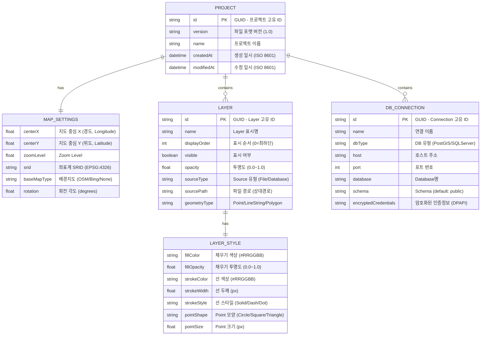
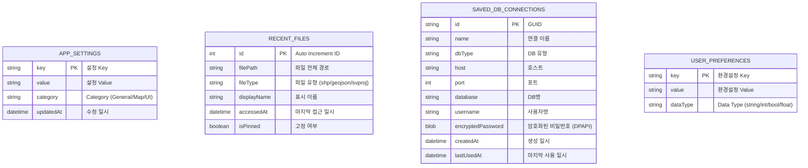
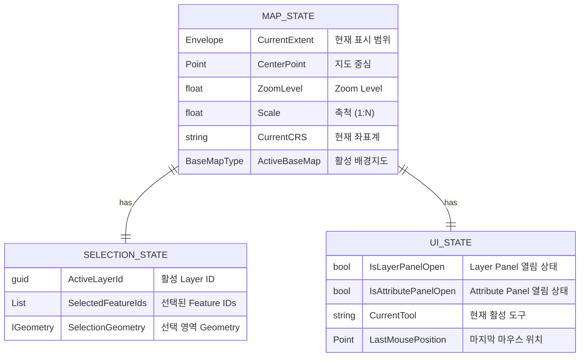

# SpatialView - Database Schema (데이터베이스 설계)

---

## 1. Project File Structure (.svproj - JSON)

프로젝트 파일은 JSON 형식으로 저장되며, 다음 구조를 따릅니다.

### 1.1 Entity Relationship Diagram



### 1.2 Project File JSON Example

```json
{
  "id": "550e8400-e29b-41d4-a716-446655440000",
  "version": "1.0",
  "name": "서울시 도로현황 분석",
  "createdAt": "2024-01-15T09:30:00Z",
  "modifiedAt": "2024-01-15T14:22:00Z",
  "mapSettings": {
    "centerX": 126.9780,
    "centerY": 37.5665,
    "zoomLevel": 12,
    "srid": "EPSG:4326",
    "baseMapType": "OSM",
    "rotation": 0
  },
  "layers": [
    {
      "id": "layer-001",
      "name": "행정구역",
      "displayOrder": 0,
      "visible": true,
      "opacity": 0.7,
      "sourceType": "File",
      "sourcePath": "./data/seoul_boundary.shp",
      "geometryType": "Polygon",
      "style": {
        "fillColor": "#4CAF50",
        "fillOpacity": 0.3,
        "strokeColor": "#2E7D32",
        "strokeWidth": 2,
        "strokeStyle": "Solid"
      }
    },
    {
      "id": "layer-002",
      "name": "도로망",
      "displayOrder": 1,
      "visible": true,
      "opacity": 1.0,
      "sourceType": "File",
      "sourcePath": "./data/roads.geojson",
      "geometryType": "LineString",
      "style": {
        "strokeColor": "#FF5722",
        "strokeWidth": 1.5,
        "strokeStyle": "Solid"
      }
    }
  ],
  "dbConnections": []
}
```

---

## 2. Application Settings (SQLite - Local Storage)

로컬 애플리케이션 설정은 SQLite 데이터베이스에 저장됩니다.

### 2.1 Settings Entity Diagram



### 2.2 SQL Schema

```sql
-- App Settings Table
CREATE TABLE IF NOT EXISTS app_settings (
    key TEXT PRIMARY KEY,
    value TEXT NOT NULL,
    category TEXT NOT NULL DEFAULT 'General',
    updated_at TEXT NOT NULL DEFAULT (datetime('now'))
);

-- Recent Files Table
CREATE TABLE IF NOT EXISTS recent_files (
    id INTEGER PRIMARY KEY AUTOINCREMENT,
    file_path TEXT NOT NULL UNIQUE,
    file_type TEXT NOT NULL,
    display_name TEXT NOT NULL,
    accessed_at TEXT NOT NULL DEFAULT (datetime('now')),
    is_pinned INTEGER NOT NULL DEFAULT 0
);

CREATE INDEX idx_recent_files_accessed ON recent_files(accessed_at DESC);

-- Saved DB Connections Table
CREATE TABLE IF NOT EXISTS saved_db_connections (
    id TEXT PRIMARY KEY,
    name TEXT NOT NULL,
    db_type TEXT NOT NULL,
    host TEXT NOT NULL,
    port INTEGER NOT NULL,
    database TEXT NOT NULL,
    username TEXT,
    encrypted_password BLOB,
    created_at TEXT NOT NULL DEFAULT (datetime('now')),
    last_used_at TEXT
);

-- User Preferences Table
CREATE TABLE IF NOT EXISTS user_preferences (
    key TEXT PRIMARY KEY,
    value TEXT NOT NULL,
    data_type TEXT NOT NULL DEFAULT 'string'
);
```

### 2.3 Default Settings

#### APP_SETTINGS

| key | value | category |
|-----|-------|----------|
| DefaultCRS | EPSG:4326 | Map |
| DefaultBaseMap | OSM | Map |
| TileCache | true | Map |
| WindowWidth | 1280 | UI |
| WindowHeight | 720 | UI |
| WindowState | Normal | UI |
| LayerPanelWidth | 280 | UI |
| AttributePanelHeight | 200 | UI |
| LastProjectPath | (empty) | General |
| AutoSave | true | General |
| AutoSaveInterval | 300 | General |

#### USER_PREFERENCES

| key | value | dataType |
|-----|-------|----------|
| Theme | Light | string |
| Language | ko-KR | string |
| ShowWelcomeDialog | true | bool |
| MaxRecentFiles | 10 | int |
| ConfirmOnDelete | true | bool |
| DefaultOpacity | 1.0 | float |

---

## 3. In-Memory Data Models (메모리 내 데이터 모델)

### 3.1 Layer Runtime Model

```mermaid
erDiagram
    LAYER_ITEM {
        guid Id "Layer 고유 ID"
        string Name "Layer 이름"
        int Order "표시 순서"
        bool IsVisible "표시 여부"
        float Opacity "투명도"
        ILayer SharpMapLayer "SharpMap Layer 참조"
        IProvider DataProvider "Data Provider 참조"
        Envelope Extent "공간 범위"
        int FeatureCount "Feature 개수"
        string CRS "좌표계"
    }
    
    FEATURE {
        int Id "Feature ID (FID)"
        IGeometry Geometry "NTS Geometry"
        Dictionary Attributes "속성 Dictionary"
        bool IsSelected "선택 여부"
        bool IsHighlighted "강조 표시 여부"
    }
    
    STYLE {
        Color FillColor "채우기 색상"
        Color StrokeColor "선 색상"
        float StrokeWidth "선 두께"
        StrokeStyle LineStyle "선 스타일"
        PointSymbol Symbol "Point 심볼"
        float SymbolSize "심볼 크기"
    }
    
    LAYER_ITEM ||--o{ FEATURE : contains
    LAYER_ITEM ||--|| STYLE : has
```

### 3.2 Map State Model



---

## 4. File Path Conventions (파일 경로 규칙)

### 4.1 Project File (.svproj)

- **위치**: 사용자가 선택한 위치
- **레이어 경로**: 프로젝트 파일 기준 **상대 경로(Relative Path)** 저장
- **절대 경로 변환**: 로드 시 `Path.GetFullPath()` 사용

### 4.2 Application Data

| Data Type | Location |
|-----------|----------|
| **Settings DB** | `%APPDATA%\SpatialView\settings.db` |
| **Tile Cache** | `%LOCALAPPDATA%\SpatialView\TileCache\` |
| **Log Files** | `%LOCALAPPDATA%\SpatialView\Logs\` |
| **Temp Files** | `%TEMP%\SpatialView\` |

### 4.3 Example Paths

```
Windows:
├── %APPDATA%\SpatialView\
│   └── settings.db              # SQLite 설정 DB
├── %LOCALAPPDATA%\SpatialView\
│   ├── TileCache\               # 배경지도 타일 캐시
│   │   ├── OSM\
│   │   └── Bing\
│   └── Logs\                    # 로그 파일
│       └── app_2024-01-15.log
└── %TEMP%\SpatialView\          # 임시 파일
```

